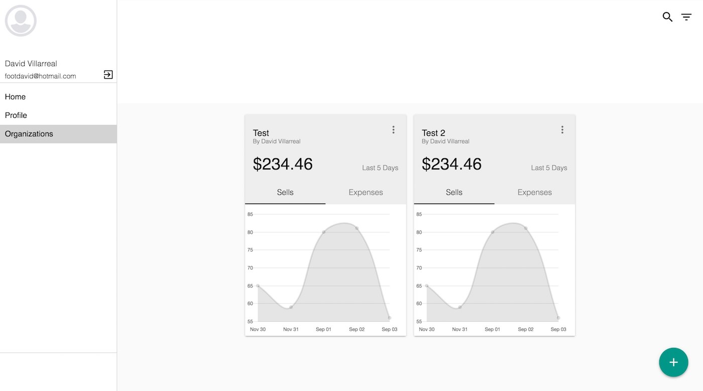
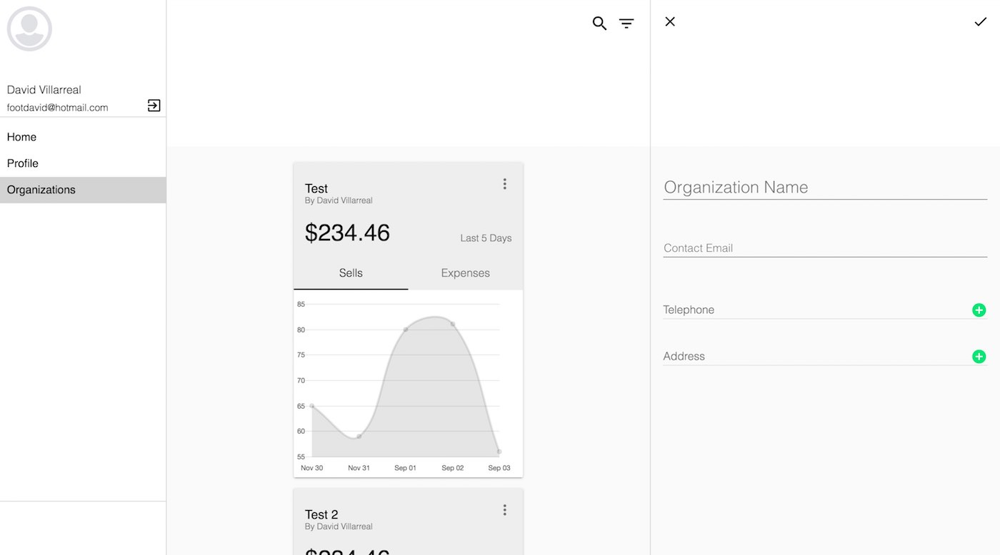

# Farmage Concept

This is the concept version of my farm management app that I've been working on for at least a year now. I started this app to learn about [MeteorJS](https://meteor.com) and to build a simple app that helps farmers manage their finance. Since this is just the concept version I focused more on the backend and database. I did start the frontend version of this app and placed it in a new repository call [Farmage-Frontend](https://github.com/Phaze1D/Farmage-Frontend).

<p align="center">

</p>

<p align="center">

</p>

## Development
To get started with developing the app on localhost first make sure that you have MeteorJS installed. After installing MeteorJS clone the repo and in the root directory run these commands

```
$ npm install
$ meteor
```

This will install the npm dependencies and start the meteor server on `localhost:3000`

### Backend
I used [SimpleSchema](https://github.com/aldeed/node-simple-schema) to defined the data models. You can find all the data models under [imports/api/collections](imports/api/collections). Each model folder has 3 files, the model definetion, the model methods and in the server folder the model publications.


### Frontend
I used Meteor's Blaze Components for the frontend wireframe. All frontend code and be found inside the [imports/ui](imports/ui) folder. I built most of the Material Design Components from scratch in hopes that I may used them again.

## Dependencies
* [MeteorJS 1.4.1.3](https://www.meteor.com/)

## License
Usage is provided under the MIT License. See [LICENSE](LICENSE) for the full details.
